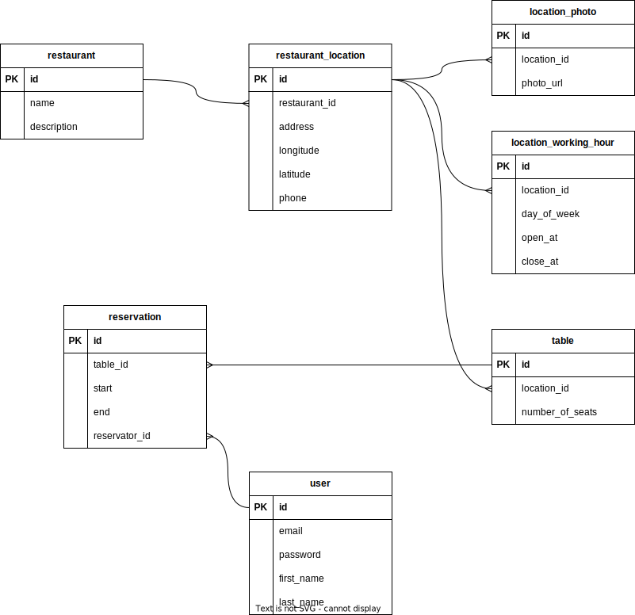

## Run locally

1. Install Java 17
2. clone reserveat repository
3. run gradle `build` task
4. launch [ReserveatApplication](reserveat-server/src/main/java/com/reserveat/ReserveatApplication.java) class
5. Swagger will be available on http://localhost:8080/swagger-ui.html

    
Diagrams

    

        
Use case diagram

        
    

    

        
Database diagram

        
    
    

